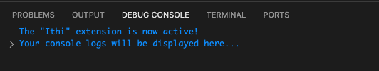

# Contributing to Ithi

Ithi is an open-source project and we welcome contributors of all skill levels. Contributions are what makes the open-source community such an amazing place to learn, inspire, and create.

We ask that contributors:

- Adhere to this project's [code of conduct](./CODE_OF_CONDUCT.md)
- Fork the repository (https://github.com//Team-Ithi/Ithi/fork)
- Create your feature branch (`git checkout -b feature/fooBar`)
- Follow the [node style guide](https://github.com/felixge/node-style-guide).
- Write tests for the new feature or bug fix that you are solving
- [Conventionally Commit](https://www.conventionalcommits.org/en/v1.0.0/) your changes (`git commit -am 'feat: add some fooBar'`)
- Push to the branch (`git push origin feature/fooBar`)
- Ensure all tests pass before send the pull-request (Use: `$ yarn test` or `$ npm run test`)
- Update the [Changelog](./ithi/CHANGELOG.md)
- Create a new Pull Request

## Source Code Organization

```
ithi/
├── .vscode
│   ├── launch.json          # Config for launching and debugging the extension
│   └── tasks.json           # Config for build task that compiles TypeScript
├── out/                     # Backend builds (dev/prod) & frontend dev builds
├── src/
│   ├── controllers/         # Extension backend logic (TS/JS)
│   ├── glossaries/          # Programming language key words (JSON)
│   ├── prompts/             # AI prompts (txt)
│   ├── test/                # Test suites
│   └── extension.ts         # Extension source code (TS/JS)
├── webview-ui/              # React frontend (TS/JS)
└── package.json             # Extension manifest
```

## Dev Installation Instructions

1. cd into the `ithi > webview-ui` directory
1. run `npm install`
1. run `npm run build`
1. cd into the `ithi` directory
1. run `npm install`
1. **Note:** ensure `package.json > engines.vscode` is accurate. This specifies the minimum version of VS Code API that the extension depends on.
1. Open user settings json in command palette `>Preferences: Open User Settings (JSON)`
1. Add the following keys and their associated values tot he JSON:

```
"ithi.openAiApiKey":"<YOUR_VALUE_HERE>" //to be used by maskAIController
```

1. Create a `.env` file in `ithi` with the following variables:
   - `PRIVATE_KEY`, `CLIENT_EMAIL`, and `PROJECT_ID` to be used by `gCloudController.ts`
1. run `npm run compile`

## Debugging Instructions

Visual Studio Code debugging tests for extensions will run inside a special instance of VS Code named the Extension Development Host, and have full access to the VS Code API.

1. Open the `src > extension.ts` file.
1. `Run > Start Debugging` or `fn + f5` will open an 'Extension Development Host' VS Code window
1. Create or open a JS file. There must be an active text editor for the extension to run.
1. In the command palette (`command + shift + p`)run the activation command, `>Ithi Translate`
   - console logs will be displayed in the original window's DEBUG CONSOLE
   - 

TODO: instructions for running tests
