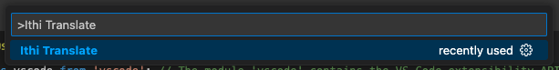
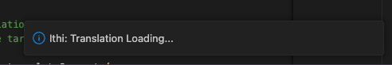
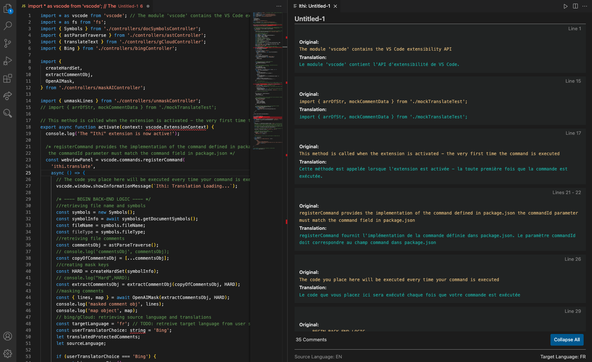
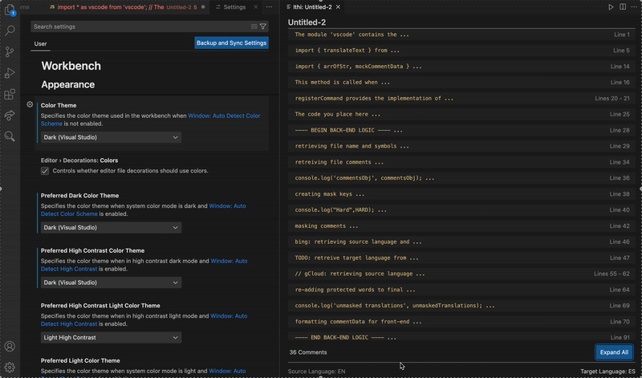

# Ithi - VS Code Extension

  

TODO: add version and extension download images

## Overview

Code comments often contain the most critical contextual information for learning, collaboration, and long-term maintainability, yet they remain locked in a single language.

In enterprise settings, where large engineering teams are distributed across regions, the inability to make technical documentation and comments multilingual slows onboarding, increases miscommunication, and can even create compliance risks.

**Ithi** (Zulu for 'It Says') is an AI-powered VS Code IDE extension designed to translate comments into a target language while preserving code integrity.

Read more about the launch of Ithi on 

TODO: link medium article

## Prerequisites

The minimum version of the VS Code API that the Ithi extension depends on is `v1.98.0`.
The setting to check you VS Code version is located at `Code > About Visual Studio Code`

## Installation

1. Open VS Code
1. Go to the Extensions view (`command+shift+x`)
1. Search for "Ithi"
1. Click **Install**

## Extension Settings

Go to `>Preferences: Open User Settings under Extensions > Ithi` and enter the following:

TODO: add images for user settings

1. **Target Language** - choose the language you want the comments translated to
1. **OpenAI API Key** - You can find your existing key _or_ create a new one in the [API Keys](https://platform.openai.com/api-keys) section on OpenAI's website.
1. **Translation Engine (Optional)** - By default, Ithi uses the **Bing** Translation engine. For a more thorough and context-informed translation, you can elect to use **Google Cloud** Translation engine by entering your gCloud:
   - `PRIVATE_KEY`
   - `CLIENT_EMAIL`
   - `PROJECT_ID`

TODO: add instructions for gcloud settings

## Usage

> **_NOTE:_** the Ithi extension will not run unless an active text editor is open

1. Open a (javascript or typescipt) file in VS Code
1. Run Ithi in the Command Palette `>Ithi Translate`

- 

1. A notification will communicate that the translation is in progress

- 

1. The Ithi webview panel will populate in the second VS Code column once translation is complete

- 

TODO: update images or make a gif

## Features

- **Source Language Auto-Detection**: detect the language of the comments in the source file.
- **Target Language Selection**: Allow the user to choose a language (163 options) to translate the comments to.
- **Programming Language Support**: Ithi supports JavaScript/TypeScript - the most used programming language globally.
- **AI Powered Translation**: translate comments from the source language to the target language
- **Webview Panel UI**: Displays data in a modularized panel webview
- **File Association**: Each Ithi panel displays with the name of the associated source file
- **Adaptive Theme Integration**: The extension seamlessly integrates with the user's preferred VS Code color theme

- 

## Technologies Used

### Core Technologies

- **VS Code Extension API** - For extension development and VS Code integration
- **React 19** - Frontend framework for the webview interface
- **TailWind CSS** - CSS framework used to apply utility class styling directly in the components
- **TypeScript/JavaScript** - Primary development languages
- **Vite** - Module bundling for both extension and webview

TODO - confirm vite is being used

### Development Tools

- **YeoMan** - Project Scaffolding
- **Babel** - JavaScript/TypeScript compilation and React preprocessing
- **ESLint** - Code quality and style checking
- **Open AI** - Comment Masking
- **Google Cloud API** - Comment translation
- **Bing Translate API** - Comment Translation
- **Mocha** - Testing framework

TODO - confirm Mocha is being used

## Development Team

| Name          | GitHub                                             | Contact                                                             |
| ------------- | -------------------------------------------------- | ------------------------------------------------------------------- |
| Aaron Chen    | [@AaronChen11](https://github.com/AaronChen11)     | chenxiyue7@gmail.com                                                |
| Disney Harley | [@harleydi](https://github.com/harleydi)           | disneyharleytech@gmail.com                                          |
| Lisa Louison  | [@llouison](https://github.com/llouison)           | [linkedin.com/in/lisa-louison](http://linkedin.com/in/lisa-louison) |
| Michael Zhao  | [@muqingzhao526](https://github.com/muqingzhao526) | muqingzhao526@gmail.com                                             |
| Yuan Liu      | [@yuan-cloud](https://github.com/yuan-cloud)       | Eucapop@gmail.com                                                   |

## Releases

To view a chronologically ordered list of notable changes to Ithi, take a look at the [Changelog](./comment-translator/CHANGELOG.md).

## Issues

For a list of identified and documented issues _or_ to open a new issue you've encountered, visit the [Issues](https://github.com/Team-Ithi/Ithi/issues) tab.

## Contributing

For information about contributing to the Ithi project, check out [Contributing](./CONTRIBUTING.md).

## License

This project is licensed under the **MIT license**.

See [LICENSE](LICENSE) for more information.
